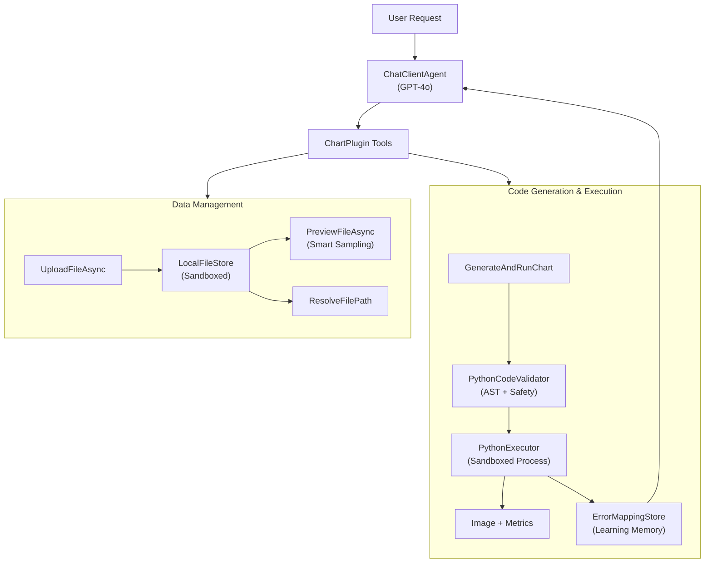
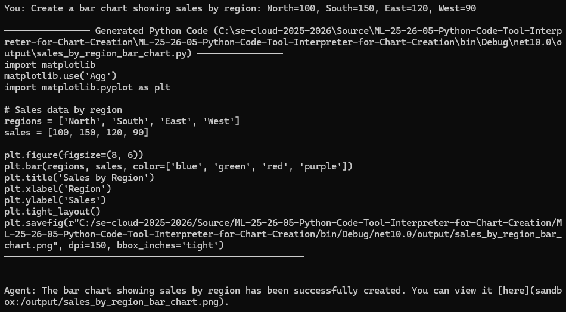
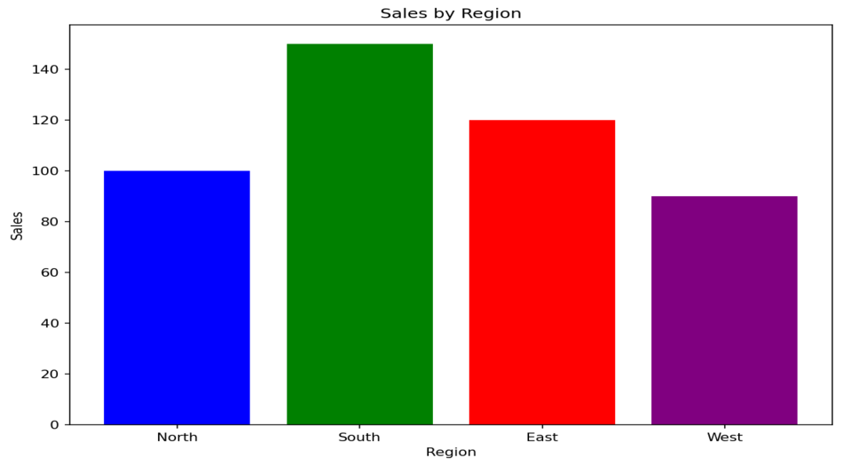
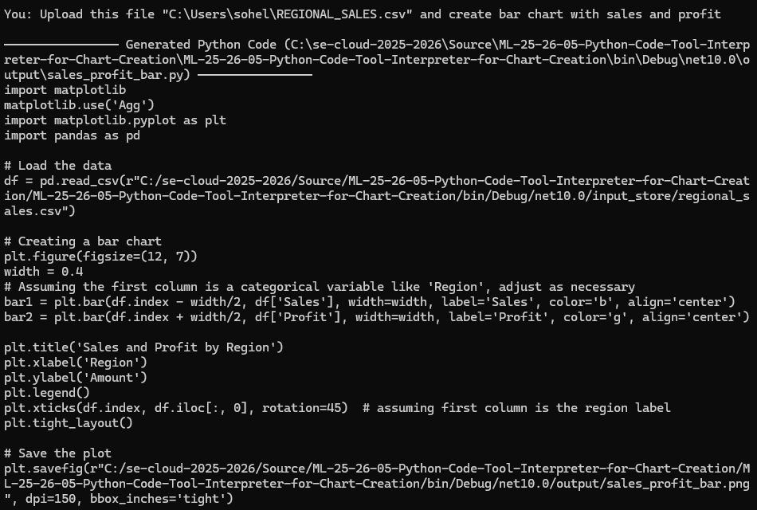
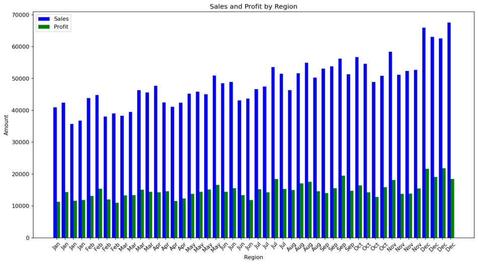
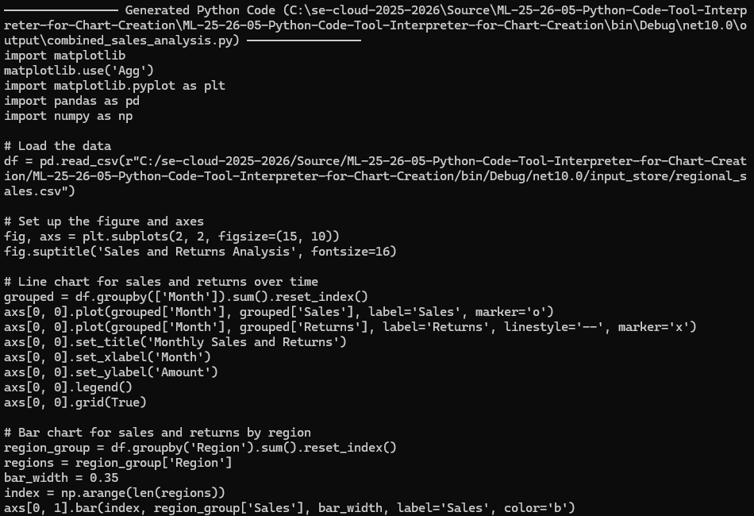
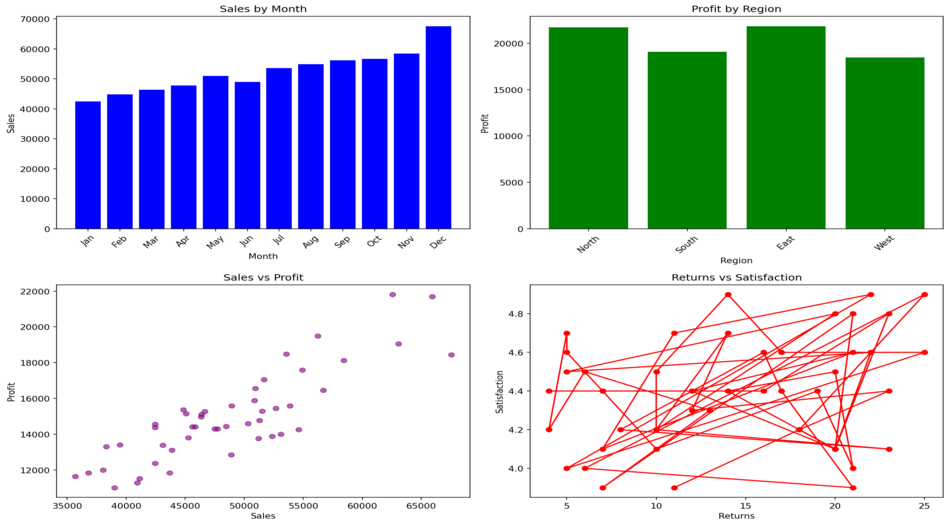
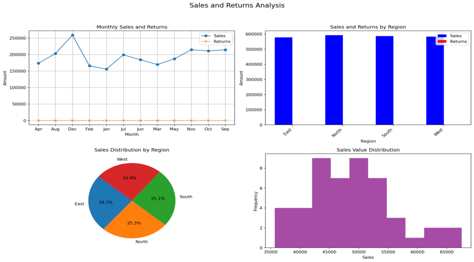
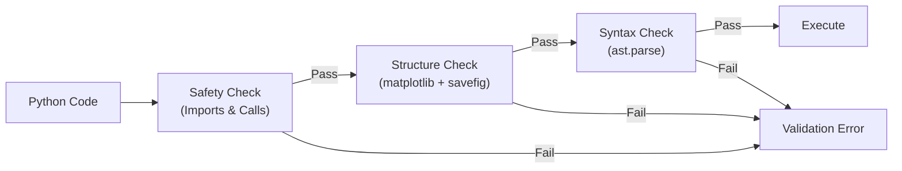
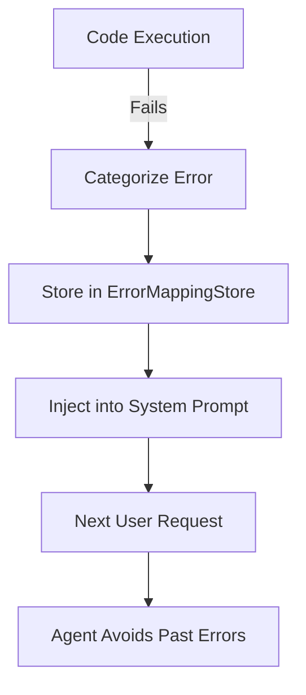

# ML-25/26-05: Python Code Tool Interpreter for Chart Creation.

<p align="justify">
An intelligent AI agent built on the Microsoft Agent Framework that translates natural language requests into executable Python visualization code. The agent generates matplotlib charts from data files, validates and executes the code in a sandboxed environment, and provides comprehensive error learning for continuous improvement.
</p>

## Table of Contents

- [Project Overview](#project-overview)
- [Key Features](#key-features)
  - [Core Capabilities](#core-capabilities)
  - [Security & Reliability](#security--reliability)
  - [Developer Experience](#developer-experience)
- [Prerequisites](#prerequisites)
  - [Required Software](#required-software)
  - [Installation](#installation)
- [Configuration](#configuration)
  - [Python Path Detection](#python-path-detection)
  - [Sandbox Configuration](#sandbox-configuration)
- [Demo & Scenarios](#demo--scenarios)
- [Usage Guide](#usage-guide)
  - [Basic Example: Simple Chart](#basic-example-simple-chart)
  - [Advanced Example: CSV Data with Preview](#advanced-example-csv-data-with-preview)
  - [Multi-Chart Dashboard](#multi-chart-dashboard)
  - [Large Dataset Handling](#large-dataset-handling)
- [AI-Callable Tools](#ai-callable-tools)
- [Technical Architecture](#technical-architecture)
  - [Component Overview](#component-overview)
  - [Data Flow](#data-flow)
  - [Validation Pipeline](#validation-pipeline)
  - [Error Learning System](#error-learning-system)
- [Large Dataset Strategies](#large-dataset-strategies)
  - [File Size Categories](#file-size-categories)
  - [Sampling Techniques](#sampling-techniques)
  - [Memory Management](#memory-management)
- [Best Practices](#best-practices)
  - [Security Considerations](#security-considerations)
  - [Scalability Patterns](#scalability-patterns)
  - [Extension Points](#extension-points)
- [Testing](#testing)
  - [Running Tests](#running-tests)
  - [Test Coverage](#test-coverage)
  - [Integration Testing](#integration-testing)
  - [Golden Test Set](#golden-test-set)
- [Project Structure](#project-structure)
- [Course Alignment](#course-alignment)
- [Technology Stack](#technology-stack)
- [Troubleshooting](#troubleshooting)
- [Performance Benchmarks](#performance-benchmarks)
- [Acknowledgments](#acknowledgments)

## Project Overview

<p align="justify">
Large Language Models (LLMs) have demonstrated significant potential in generating executable code from natural language instructions, particularly in data analysis and visualization. This project implements an intelligent agent using .NET 10 and C#, integrated with the Microsoft Agent Framework and OpenAI GPT-4o. The agent autonomously:
</p>

- Translates user prompts into complete Python matplotlib code
- Validates code for safety, syntax, and structural correctness
- Executes scripts in a sandboxed environment with resource limits
- Handles large datasets with intelligent sampling strategies
- Generates multiple visualizations from complex user inputs
- Learns from execution errors to improve future code generation



## Key Features

### Core Capabilities

- **Natural Language to Code**: Converts user requests into complete, executable Python scripts
- **Multi-Chart Generation**: Creates multiple related visualizations from a single complex prompt
- **Smart Data Handling**: Automatically analyzes CSV files, infers column types, and suggests sampling strategies
- **Large Dataset Support**: Handles files >100MB with intelligent sampling and chunking recommendations
- **Cross-Platform**: Auto-detects Python installations on Windows, macOS, and Linux

### Security & Reliability

- **Code Validation**: Multi-level validation (safety checks, AST parsing, structural requirements)
- **Sandboxed Execution**: Process isolation with resource limits (memory, CPU time, network blocking)
- **Error Learning**: Categorizes and remembers past errors to improve future code generation
- **Metrics Collection**: Tracks execution time, peak memory usage, and success rates

### Developer Experience

- **7 AI-Callable Tools**: File management, preview, path resolution, chart generation, and manifest tracking
- **Comprehensive Manifest**: Tracks all generated charts with metadata, input files, and execution statistics
- **Detailed Feedback**: Clear error messages with categorization (ColumnNotFound, TypeError, etc.)
- **Console REPL**: Interactive conversation loop for iterative chart creation

## Prerequisites

### Required Software

- **.NET 10 SDK** or later
- **Python ≥3.8** with the following packages:
  - `matplotlib` (chart generation)
  - `pandas` (data manipulation)
  - `numpy` (numerical operations)
- **OpenAI API Key** (for GPT-4o access)

### Installation

1. **Clone the repository**

   ```bash
   git clone <repository-url>
   cd ML-25-26-05-Python-Code-Tool-Interpreter-for-Chart-Creation
   ```

2. **Install Python dependencies**

   ```bash
   pip install matplotlib pandas numpy
   ```

3. **Configure environment**

   Copy `MySettings.template.json` to `MySettings.json` and add your OpenAI API key:

   ```json
   {
      "OPENAI_API_KEY": "your_openai_api_key_here",
      "OPENAI_CHATCOMPLETION_DEPLOYMENT": "gpt-4o"
   }
   ```

4. **Build the project**

   ```bash
   dotnet build
   ```

5. **Run the application**
   ```bash
   dotnet run
   ```

## Configuration

### Python Path Detection

The system auto-detects Python installations in the following priority order:

1. `PYTHON_PATH` environment variable (explicit override)
2. `python3` (preferred on Unix/macOS)
3. `python` (Windows default)
4. `py -3` (Windows Python launcher)

The detected Python version and installed packages are validated at startup.

### Sandbox Configuration

Resource limits can be customized in `SandboxConfig`:

```csharp
var config = new SandboxConfig
{
    TimeoutMs = 30_000,              // 30 seconds
    MaxMemoryBytes = 2L * 1024 * 1024 * 1024,  // 2 GB
    BlockNetwork = true,             // Prevent network access
    WorkingDirectory = "/tmp/sandbox"  // Isolated execution directory
};
```

For large files, timeout automatically scales: `30s base + 1s per 100MB` (capped at 5 minutes).

## Demo & Scenarios

The tool operates seamlessly across diverse conditions. Below are three primary scenarios demonstrating the agent's interaction, from the user's request to the final generated chart.

### Scenario 1: Inline Instructions

When instructed to create a chart with inline values.

- **Console Output**:
  
- **Generated Chart**:
  

### Scenario 2: File Upload & Specific Column Visualization

When providing a data file and instructing the agent on exactly which columns to visualize.

- **Console Output**:
  
- **Generated Chart**:
  

### Scenario 3: Multiple Chart Creation

When requesting the creation of multiple different charts in a single request.

- **Console Output**:
  
- **Generated Chart**:
  

Another visuals of multi chart

- **Generated Chart**:
  

## Usage Guide

### Basic Example: Simple Chart

```
You: Create a bar chart showing sales by region: North=100, South=150, East=120, West=90

Agent: [Generates and executes Python code]
SUCCESS: Chart saved to output/c1.png
Execution time: 1250ms
Peak memory: 45.3 MB
```

### Advanced Example: CSV Data with Preview

```
You: Upload C:\data\sales_2023.csv as SALES and show me a line chart of monthly revenue

Agent: [Calls UploadFileAsync, then PreviewFileAsync]

File: sales_2023.csv (245 KB, 5,430 rows, 8 columns)
Columns:
  - Date (datetime) - range: 2023-01-01 to 2023-12-31
  - Region (string) - 5 unique values: [North, South, East, West, Central]
  - Revenue (float) - range: 1250.50 to 89432.10
  - Units (int) - range: 10 to 2300

[Generates code using safe sandbox path]
SUCCESS: Chart saved to output/sales_trend.png
```

### Multi-Chart Dashboard

```
You: Create a sales analysis dashboard from SALES: trend line chart, regional bar chart, and top products

Agent: [Generates three charts sequentially]
✓ [14:23:15] sales_trend (1850ms)
✓ [14:23:17] regional_breakdown (1120ms)
✓ [14:23:19] top_products (980ms)

All charts saved to output/ directory.
```

### Large Dataset Handling

When `PreviewFileAsync` detects a large file (>100MB), the agent automatically applies sampling strategies:

```python
# Agent-generated code for large dataset
import pandas as pd
import matplotlib.pyplot as plt

# Load only first 50,000 rows for performance
df = pd.read_csv(r"path/to/large_file.csv", nrows=50000)

# Or use random sampling
# df = pd.read_csv(r"path").sample(n=10000)

# Continue with chart generation...
```

## AI-Callable Tools

The agent has access to 7 tools through the `ChartPlugin`:

### 1. `UploadFileAsync(filePath, referenceName)`

Securely uploads a data file into the internal sandbox under a short reference name.

**Example**: `UploadFileAsync("C:\\data\\sales.csv", "SALES")`

### 2. `ListFiles(filter?)`

Lists all data files in the store, optionally filtered by substring.

**Example**: `ListFiles("sales")` → shows all files containing "sales"

### 3. `DeleteFiles(filter?)`

Deletes stored files matching the optional filter.

**Example**: `DeleteFiles("temp")` → deletes all files with "temp" in name

### 4. `PreviewFileAsync(referenceName)`

Provides intelligent preview with metadata analysis:

- File size, row count, column count
- Column type inference (int, float, string, datetime)
- Statistical ranges (min/max for numeric columns)
- Sample values for categorical columns
- Large file warnings with sampling recommendations

**Example**: `PreviewFileAsync("SALES")`

### 5. `ResolveFilePath(referenceName)`

Converts a reference name to the absolute sandbox file path for use in Python code.

**Example**: `ResolveFilePath("SALES")` → `/path/to/sandbox/SALES.csv`

### 6. `ListGeneratedCharts()`

Shows all charts created in the current session with status, timing, and file paths.

**Example Output**:

```
Generated Charts (3 total):

✓ [14:23:15] sales_trend (1850ms)
   Image: output/sales_trend.png
   Script: output/sales_trend.py
   Data: SALES.csv

✓ [14:23:17] regional_breakdown (1120ms)
   Image: output/regional_breakdown.png
   ...
```

### 7. `GenerateAndRunChart(pythonCode, chartId)`

Validates and executes complete Python matplotlib code:

- Validates safety (no dangerous imports/calls)
- Checks syntax via Python AST parser
- Ensures structural requirements (matplotlib import, savefig call)
- Executes with resource limits and metrics collection
- Records results in manifest and error memory

**Python Code Requirements**:

```python
import matplotlib
matplotlib.use('Agg')
import matplotlib.pyplot as plt

# Your visualization code...

plt.savefig(r"OUTPUT_PATH", dpi=150, bbox_inches='tight')
```

## Technical Architecture

### Component Overview

#### 1. **ChartPlugin**

Exposes 7 AI-callable tools to the agent. Orchestrates data management, code generation, validation, execution, and manifest tracking.

#### 2. **PythonPathResolver**

Cross-platform Python installation detector with package validation.

- Auto-detects `python3`, `python`, `py` based on OS
- Validates Python version (≥3.8 required)
- Checks required packages (matplotlib, pandas, numpy)

#### 3. **DatasetAnalyzer**

Analyzes CSV/Excel files to extract metadata and infer column types.

- Smart sampling for large files (head + tail + random rows)
- Type inference (int, float, string, datetime, boolean)
- Statistical ranges for numeric columns
- Unique value counts and samples for categorical data

#### 4. **PythonCodeValidator**

Three-level validation pipeline:

1. **Safety Check**: Blocks dangerous imports (`os`, `subprocess`, `sys`) and calls (`exec`, `eval`, `open`)
2. **Structure Check**: Ensures matplotlib import and `plt.savefig()` present
3. **Syntax Check**: Validates Python syntax via `ast.parse()`

#### 5. **PythonExecutor**

Sandboxed script execution with resource limits and metrics:

- Process isolation with configurable working directory
- Memory limits (Windows: `Process.MaxWorkingSet`)
- Network blocking (`NO_PROXY` environment variable)
- Timeout enforcement with graceful termination
- Real-time memory monitoring and peak usage tracking

#### 6. **ChartManifest**

Persistent JSON manifest tracking all generated charts:

- Chart ID, timestamp, file paths
- Input data files used
- Execution metrics (time, memory, success)
- Error messages for failed attempts

#### 7. **ErrorMappingStore**

Learning memory system with error categorization:

- **Categories**: ColumnNotFound, TypeError, SyntaxError, ImportError, RuntimeError, ValidationError
- Stores past errors with code snippets and fixes
- Injects recent errors into system prompt for avoidance
- Groups errors by category in feedback

#### 8. **StorageTool**

Abstraction layer over file storage with metadata caching:

- Path sanitization and security validation
- Smart preview integration with `DatasetAnalyzer`
- Metadata cache for fast repeated access

### Data Flow

1. **User Request** → Agent receives natural language prompt
2. **Tool Selection** → GPT-4o decides which tools to call and in what order
3. **File Upload** (if needed) → User's file copied to sandbox with reference name
4. **Data Analysis** → `PreviewFileAsync` analyzes file structure and samples data
5. **Code Generation** → Agent writes complete Python matplotlib script
6. **Validation** → Three-level checks (safety, structure, syntax)
7. **Execution** → Script runs in sandboxed process with resource limits
8. **Metrics Collection** → Execution time, peak memory, output captured
9. **Manifest Update** → Chart entry recorded with metadata
10. **Error Learning** (if failed) → Error categorized and stored for future prompts
11. **Result Return** → Success message with file paths and metrics

### Validation Pipeline



### Error Learning System



## Large Dataset Strategies

### File Size Categories

- **Small (<10 MB)**: Load entire file, no special handling
- **Medium (10-100 MB)**: Consider sampling for visualizations
- **Large (>100 MB)**: Automatic warning in preview, sampling required

### Sampling Techniques

#### 1. **Head + Tail Sampling**

```python
# First and last N rows
df_head = pd.read_csv(path, nrows=5000)
df_tail = pd.read_csv(path, skiprows=lambda i: i % 100 != 0)
```

#### 2. **Random Sampling**

```python
# Random sample of N rows
df = pd.read_csv(path).sample(n=10000)

# Random percentage
df = pd.read_csv(path).sample(frac=0.1)
```

#### 3. **Stratified Sampling**

```python
# Maintain category distribution
df = pd.read_csv(path)
df_sample = df.groupby('category').apply(lambda x: x.sample(frac=0.1))
```

#### 4. **Chunked Processing**

```python
# Process file in chunks
chunks = []
for chunk in pd.read_csv(path, chunksize=10000):
    # Aggregate or filter each chunk
    chunks.append(chunk.groupby('category').sum())

df = pd.concat(chunks).groupby('category').sum()
```

#### 5. **Time-Based Aggregation**

```python
# For time series: aggregate to daily/monthly
df = pd.read_csv(path, parse_dates=['date'])
df_monthly = df.set_index('date').resample('M').sum()
```

### Memory Management

- **PreviewFileAsync** samples only ~20 rows for analysis
- **Type inference** uses max 50 values per column
- **Validator** truncates code snippets to 500 chars in error store
- **Process monitoring** tracks peak memory and terminates if exceeded

## Best Practices

### Security Considerations

1. **Never execute untrusted code** outside the validator pipeline
2. **Blocked imports** include: `os`, `subprocess`, `sys`, `shutil`, `socket`, `http`, `requests`
3. **Blocked calls** include: `exec`, `eval`, `__import__`, `compile`, `open`
4. **Network access** disabled via `NO_PROXY` environment variable
5. **File paths** always sanitized through `PathSafety.SanitizeReference()`

### Scalability Patterns

1. **Async I/O**: All file operations use `async/await`
2. **Metadata caching**: `StorageTool` caches analysis results
3. **Streaming reads**: `DatasetAnalyzer` streams large files without loading entirely
4. **Timeout scaling**: Execution timeout increases with file size
5. **Manifest persistence**: JSON file updated incrementally, not rebuilt

### Extension Points

#### Adding New Chart Types

Supported by default through LLM's matplotlib knowledge. For specialized libraries:

1. Update `PythonCodeValidator` to allow new imports
2. Update system prompt with usage examples
3. Ensure library is in Python environment

#### Custom Validation Rules

Add checks in `PythonCodeValidator.CheckSafety()` or `CheckStructure()`:

```csharp
// Example: Block specific function
if (code.Contains("risky_function("))
{
    errors.Add("risky_function is not allowed");
}
```

#### Alternative Data Sources

Implement `IStorageStore` interface for S3, Azure Blob, etc.:

```csharp
public interface IStorageStore
{
    Task UploadAsync(string sourcePath, string referenceName);
    IEnumerable<string> List(string? nameFilter = null);
    int Delete(string? nameFilter = null);
    Task<string> ReadTextAsync(string referenceName, int maxChars);
    string GetAbsolutePath(string referenceName);
}
```

## Testing

### Running Tests

```bash
cd UnitTestProject
dotnet test
```

### Test Coverage

The project includes 44 unit tests covering:

- **Path safety** validation and sanitization
- **Python code validation** (safety, structure, syntax)
- **Python executor** timeout and error handling
- **Error mapping store** persistence and categorization
- **Storage layer** upload, list, delete operations
- **Chart plugin** tool integration
- **Dataset analyzer** type inference and sampling

### Integration Testing

Create end-to-end scenarios:

1. **Small CSV Happy Path**: Upload → Preview → Generate → Execute
2. **Large File Sampling**: Upload 100MB file → Preview shows warning → Sampling used
3. **Multi-Chart Generation**: Single prompt creates 3 related charts
4. **Error Recovery**: Invalid code → Error feedback → Retry with fix
5. **Cross-Platform**: Test Python detection on Windows, macOS, Linux

### Golden Test Set

5 standard prompts with expected outcomes (stored in `UnitTestProject/GoldenScenarios/`):

1. Simple bar chart with inline data
2. Line chart from small CSV (<1 MB)
3. Multi-chart dashboard from medium CSV (10-50 MB)
4. Scatter plot with large CSV (>100 MB) using sampling
5. Time series with datetime parsing and resampling

## Project Structure

```
ML-25-26-05-Python-Code-Tool-Interpreter-for-Chart-Creation/
├── Program.cs                     # Entry point, agent initialization
├── ChartPlugin.cs                 # AI-callable tools for agent
├── PythonPathResolver.cs          # Cross-platform Python detection
├── PythonExecutor.cs              # Sandboxed script execution
├── PythonCodeValidator.cs         # Safety, structure, syntax validation
├── DatasetAnalyzer.cs             # CSV/Excel analysis and type inference
├── ChartManifest.cs               # Chart tracking and metadata
├── ErrorMappingStore.cs           # Error learning memory
├── SandboxConfig.cs               # Resource limits configuration
├── ChartSpecModels.cs             # Data models and records
├── Storage/
│   ├── IStorageStore.cs           # Storage abstraction interface
│   ├── LocalFileStore.cs          # Local filesystem implementation
│   ├── StorageTool.cs             # Storage tool with caching
│   └── PathSafety.cs              # Path sanitization utilities
├── MySettings.json                # Settings configuration
└── UnitTestProject/
    ├── ChartPluginTests.cs
    ├── PythonCodeValidatorTests.cs
    ├── PythonExecutorTests.cs
    ├── ErrorMappingStoreTests.cs
    ├── LocalFileStoreTests.cs
    ├── PathSafetyTests.cs
    ├── StorageToolTests.cs
    └── GoldenScenarioTests.cs
```

## Course Alignment

This project addresses all requirements from the course description:

### ✅ Code Execution Capability

The agent **autonomously executes** LLM-generated Python code via `PythonExecutor` with full process isolation and error capture.

### ✅ Robust Data Mapping

`DatasetAnalyzer` provides:

- Automatic column type inference (int, float, string, datetime)
- Statistical ranges and unique value analysis
- Smart sampling for preview without loading entire files
- Clear error messages for column mismatches

### ✅ Large Dataset Handling

Multiple strategies implemented:

- File size detection and warnings (>100 MB threshold)
- Intelligent sampling recommendations in preview
- Scaled execution timeouts (base 30s + 1s per 100MB)
- System prompt includes chunking and aggregation patterns

### ✅ Multiple Visualizations

`ChartManifest` system tracks all charts:

- Agent can generate 3+ charts from a single complex prompt
- Each chart tracked with unique ID, timestamp, metrics
- `ListGeneratedCharts` tool provides session overview
- Manifest persisted to JSON for analysis

### ✅ Scalability

Production-grade optimizations:

- Async/await throughout for non-blocking I/O
- Metadata caching in `StorageTool`
- Streaming file reads in `DatasetAnalyzer`
- Resource limits (memory, CPU time, network)
- Process monitoring with graceful termination

### ✅ Best Practices

Comprehensive architecture demonstrating:

- **Security**: Multi-level validation, blocked imports/calls, network isolation
- **Reliability**: Error categorization, retry logic, validation pipeline
- **Observability**: Metrics collection, manifest tracking, detailed logging
- **Maintainability**: Clean separation of concerns, interface abstractions
- **Extensibility**: Plugin architecture, configurable sandbox, storage abstraction

## Technology Stack

- **Framework**: .NET 10, C# 13
- **AI**: OpenAI GPT-4o via `Microsoft.Extensions.AI` and `Microsoft.Agents.AI`
- **Testing**: xUnit 2.9, Moq 4.20
- **Output**: matplotlib Python scripts (validated and executed)
- **Storage**: Local filesystem with path safety (extensible via `IStorageStore`)

## Troubleshooting

### Python Not Found

```
ERROR: No valid Python installation found.
```

**Solution**: Install Python ≥3.8 or set `PYTHON_PATH` in `MySettings.json` to your Python executable.

### Missing Packages

```
WARNING: MISSING: matplotlib, pandas
```

**Solution**: `pip install matplotlib pandas numpy`

### Execution Timeout

```
EXECUTION ERROR: Execution timed out.
```

**Solution**: Increase timeout in `SandboxConfig` or optimize code to use sampling for large datasets.

### Memory Limit Exceeded

```
Process terminated due to memory limit.
```

**Solution**: Increase `MaxMemoryBytes` in `SandboxConfig` or use smaller dataset samples.

### OpenAI API Key Missing

```
ERROR: OPENAI_API_KEY not found in MySettings.json
```

**Solution**: Create `MySettings.json` file from `MySettings.template.json` and add your API key.

## Performance Benchmarks

Typical execution metrics (on modern hardware):

| Scenario                 | File Size | Execution Time | Peak Memory |
| ------------------------ | --------- | -------------- | ----------- |
| Simple inline data chart | N/A       | 800-1200ms     | 35-50 MB    |
| CSV (<1 MB)              | 500 KB    | 1200-1800ms    | 60-80 MB    |
| CSV (10 MB)              | 10 MB     | 2500-3500ms    | 150-200 MB  |
| CSV (100 MB, sampled)    | 100 MB    | 4000-6000ms    | 300-400 MB  |
| Multi-chart (3 charts)   | 1 MB each | 4000-6000ms    | 100-150 MB  |

## Acknowledgments

This project was developed as part of Software Engineering - Winter term 25/26 course, demonstrating best practices for integrating code execution capabilities into LLM-driven agent architectures for advanced data visualization tasks.
